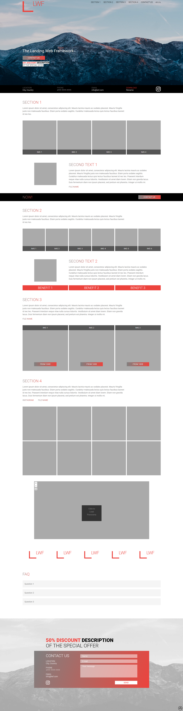

# The Landing Web Framework v2

## Description

A flexible PHP framework for creating multi-language landing pages with various content blocks including texts, images, 360° views, banners, FAQ sections, and more. Built with MVC architecture and enhanced with SEO optimization features.

**Version 2** (October 2025) includes significant improvements for better SEO, additional content blocks, and extended functionality.

## Installation

1. Clone or download this repository to your local or web server
2. The framework will work immediately with default content

## Configuration

### Basic Setup

1. **Images**: Add your images to the `_img` folder
   - Replace default images in `_img/lwf` folder:
     - `logo.svg`
     - `header-bg.jpg` 
     - `footer-bg.jpg`
   - Update `favicon.svg`

2. **Files**: Add downloadable files for visitors in the `_file` folder

### Content Structure

3. **Main Configuration**: Edit `date.php` to modify structure and content
   - Update "General date, header and footer" section
   - Configure "Sections" with names and quantity
   - Add content blocks to appropriate sections:
     - Text blocks (first, second)
     - Image blocks (3, 4, or 6 images with text)
     - Benefits section
     - 360° views
     - FAQ section
     - Current status ("Now")
     - Custom code blocks

4. **Multi-language Support**: 
   - The framework supports multiple languages
   - `index.php` detects user language from `$LANG` variable
   - Provide content for all supported languages

5. **Theme**: 
   - Update `$THEME` with your CSS filename (without `.css` extension)
   - Copy and customize `css/general.css` for your design

6. **Contact Form**:
   - Update email recipients in `$to` and `$headers` variables (lines 282-287 in `lwf/landing.php`)

### New v2 Features

7. **SEO Optimization**:
   - Configure OpenGraph meta tags in appropriate sections
   - Update `robots.txt` and `sitemap.xml` for your domain

8. **Blog Integration**:
   - Supports [MicroBlogger (MB)](https://github.com/evbkv/mb) framework for blogging functionality
   - Configure blog settings in separate MB configuration

9. **Custom Code**:
   - Add custom PHP/HTML code via `user-code.php` (e.g., calculators, interactive elements)
   - Insert tracking scripts, chat widgets, or JSON-LD via `scripts.php`

## Roadmap

* Admin panel for content management (admin class in `lwf/admin.php`)
* Custom error pages (error class in `lwf/err.php`)
* Additional content block types
* Enhanced blog integration features

## Screenshot

## Author

[Evgenii Bykov](https://github.com/evbkv)

## License

GNU General Public License v3.0