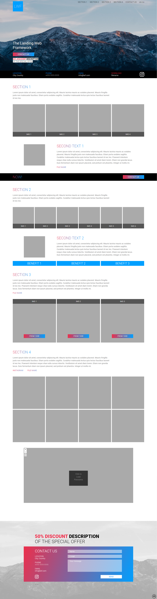

# The Landing Web Framework

## Description

I needed a framework for my own project that would support multiple languages and have different content blocks — texts, images, 360 deg, banners and other. This framework was maked for my goals, it have MVC structure and writen on php.

For example, my landing page project: [3drender.pro](https://3drender.pro).

## Installation

Get this repository and save it on your local or web host.

So, it will working with default content.

## Configure

### Images

1. Save your images in _img_ folder.
2. Change this files _logo.png_, _header-bg.jpg_ and _footer-bg.jpg_ in _img/lwf_ folder.
3. Change _favicon.ico_.

### Files

4. Save your files for guest download in _file_ folder.

### Change structure and content

5. For changing structure and content you need to change _date.php_ file.

So, it will biggest work!

First, you need change _"General date, header and footer"_. Next correct _"Sections"_, where count of sections and it's names.

And after, change: _"First text"_, _"Second text"_, _"Image block with 3 pictures, text and button"_, _"Image block with 4 pictures and text"_, _"Image block with 6 pictures and text"_, _"Benefits"_, _"360 deg"_ and _"Now"_. These blocks can be into these sections. You need to write section name and your block content, this is block will be into the section now.

Important, this framework is written to use multiple languages, so if you have two languages, then you should always have two content, if three, then three content. _index.php_ defines the user's language, if it's specified in _$LANG_, then the user's language is selected, else the first language in _$LANG_ is selected.

Change _$THEME_ on your css file name without _.css_ and path (look next step).

Change the emails in the form of a sent message in _$to_ and _$headers_ variables on lines 282-287 in _lwf/landing.php_.

### CSS

6. Copy and rename _css/general.css_.
7. Correct your css file for your style!

## Roadmap

* Admin page for create/change structure and content (admin class in _lfw/admin.php_).
* Error page (error class in _lfw/err.php_).
* Some other content blocks...

## Screenshot

## Author

[Evgenii Bykov](https://github.com/evbkv)

## License

GNU General Public License v3.0
